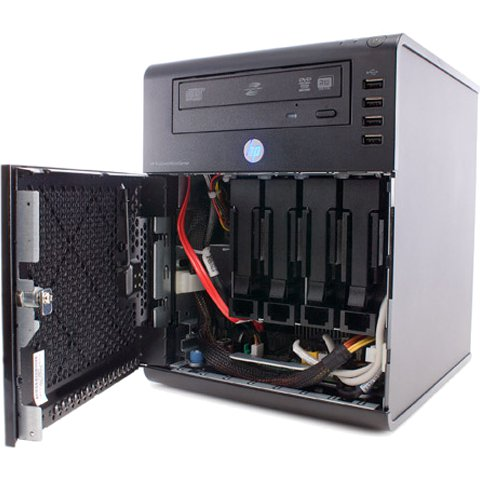
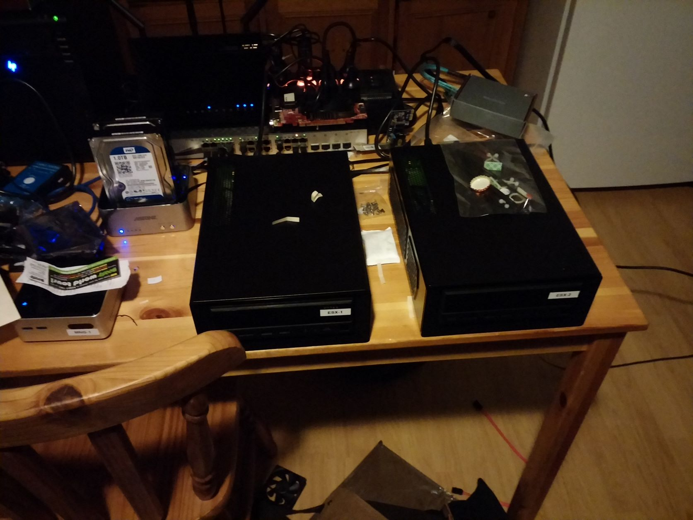
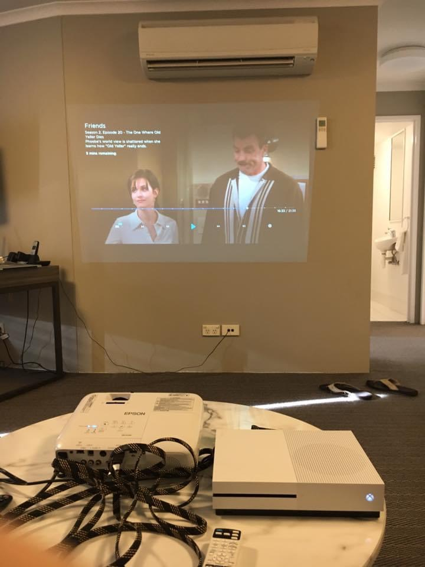
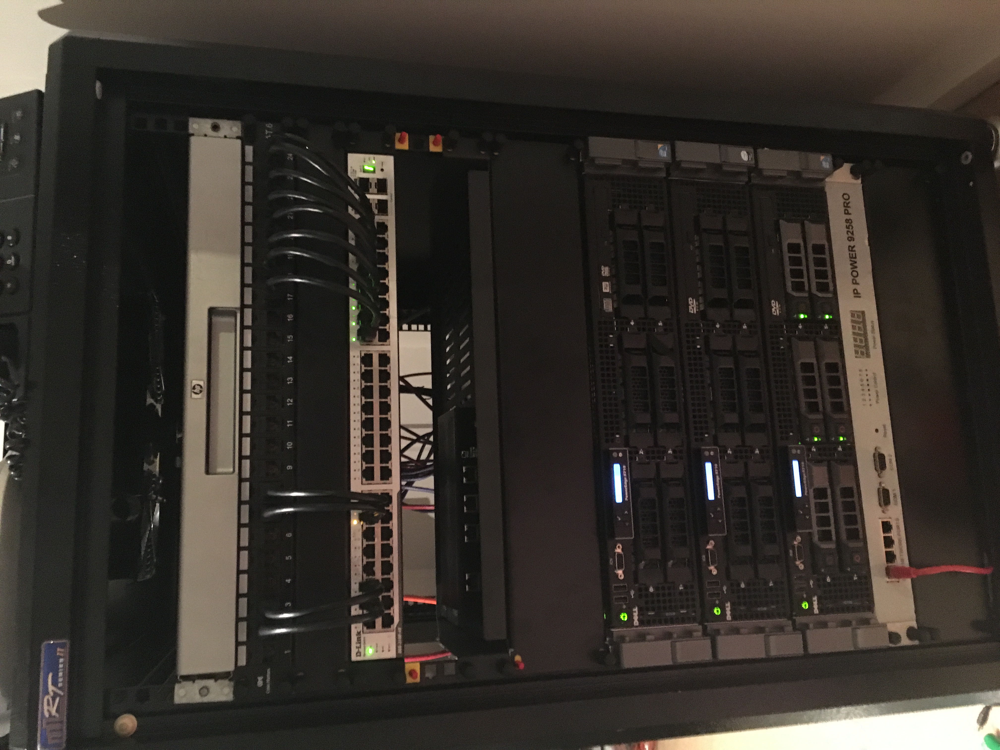
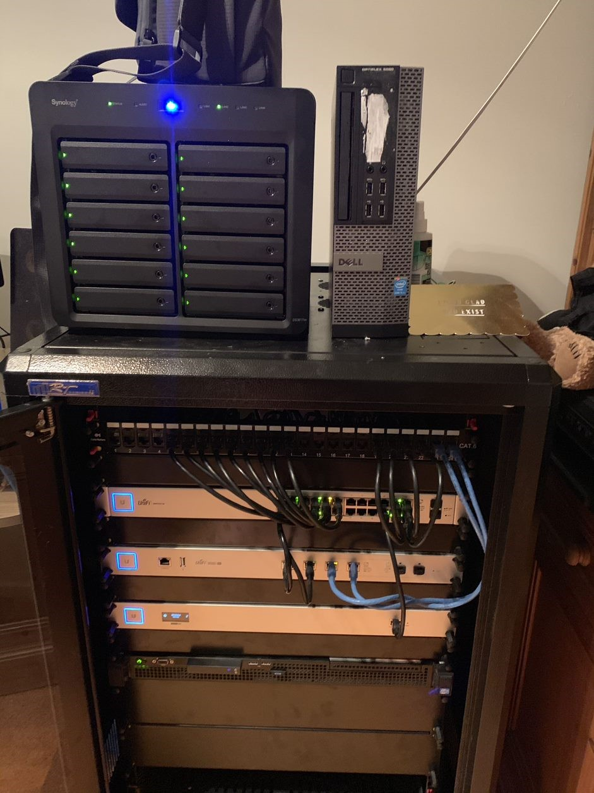
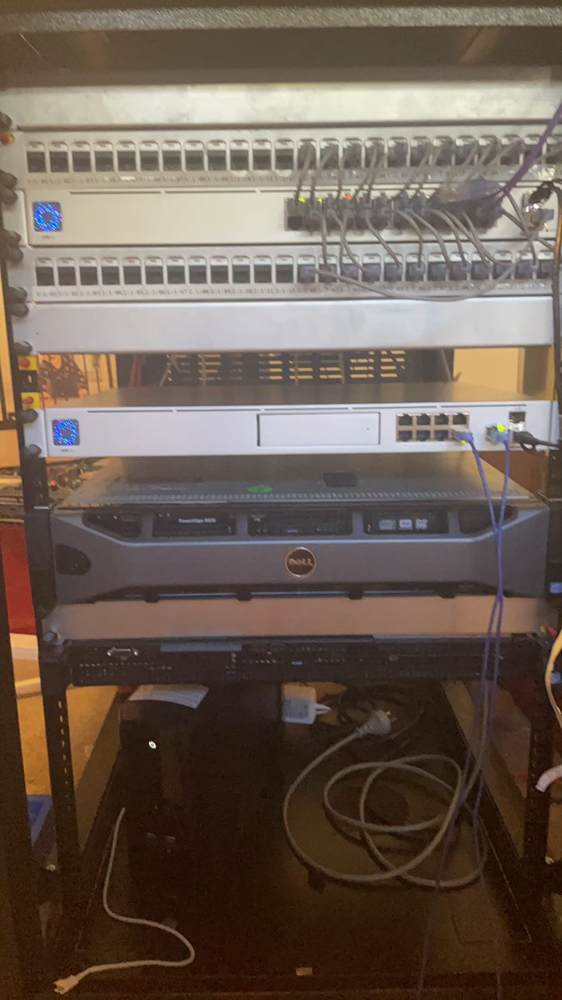
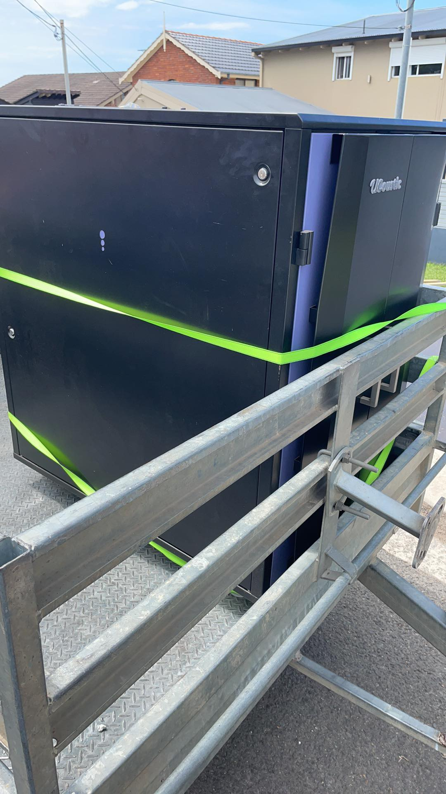

_Side Note: This post got away with me. I hope you find it enjoyable, and I'll try to break up future ones into smaller pieces._

I had a lot of time over Christmas and decided to rebuild my homelab. To bring you all on the journey, I decided to reinvigorate this blog and write it up (although it's taken a month from the initial creation of this folder to finalising the file!). The intent behind this series of posts is to talk about my lab's history and demonstrate the value of any homelab to a Cyber Security Professional, especially if you are trying to interact with operations or architects. 

Before we talk about what I've built this time, I feel a brief history lesson of how I've gone through homelabs over the years, how it's evolved, and what I've learnt through the years. While I'm not going to go through every iteration (there were many changes over the years), I will talk about the most "iconic" setups.

## prehistory:
When @wan0net was a small 17-year-old waiting to start his university degree, he wanted to try Linux. So he took his trusty Acer TravelMate laptop that was bought for him for passing his GCSEs two years ago and said, what the hell, why not install Linux on here?

And so his rabbit hole down the path of Linux began, and the first time he went, "Oh crap, I just killed my Windows install."

First, I made the mistake of trying Gentoo. At this time, bandwidth caps existed (Our house had a monthly cap of 12Gb(!), except Bigpond had a trick where the last day of the month they uncapped you. Thats when we did all our downloading), and the Gentoo ISO looked significantly smaller than anything else I could find. I was very wrong, and let's not talk about that one. And because I didn't have a reinstall disk for Windows at the time... I was stuck with Linux.

Then I tried OpenSUSE because I went to a gaming cafe one day, and they just happened to have a spare CD. That lasted for a while. At this point, the hinges on my laptop had broken, so I had the laptop on a cabinet by the side of my bed, a keyboard and mouse in my lap, and a monitor on a side table. I wish I had a photo because it is just the epitome of a teenage boy who broke his toys and needed to find a way to make it work.

Finally, I met Ubuntu, which started a longstanding relationship with the distro. In those days (and I think still now?), you could order an Ubuntu CD to be delivered to your house, with stickers, free of charge. No bandwidth issues anymore! Based on what is terrible memory, I'm going to say that I started with Hardy (8.04 LTS), and ever since then, I've used every single LTS edition of Ubuntu without fail and ignored the other editions.

Understanding and using Linux was something I wasn't really taught at University, and it became a big boon when my first job involved systems administration tasks. Since then, I've had to use Linux in some form for all my jobs.

An accurate representation of this entire story can be seen in the preview image above.

This all happened pre-me having a dedicated "lab" compared to my normal "prod", but it is good context for where I went next.

## homelab v1: eeePC + external drives (2010)

- 1 x Server - Asus eeePC 904HA
  - Intel Atom B270 @ 1.6GHz
  - 1Gb DDR2
  - 160Gb HDD
  - Wifi 802.11 b/g
  - 1Gb Ethernet
- 2 x Seagate 2TB External HDD
_The aforementioned Acer Travelmate compared to the Asus eeePC_

In great IT tradition, my first spelunk into homelabs was reusing equipment I no longer used daily. I was in my second year of university and had just bought a new Acer Netbook (I think it had Windows 7 on it). So my old Asus eeePC was turned into an Ubuntu Server NAS, with two external Seagate drives purchased from Harvey Norman for $99 in the NY sales (a deal at the time). I started playing with things like [XBMC, now Kodi](https://kodi.tv), and [znc](https://wiki.znc.in/ZNC), running them on the server and accessing them from my netbook. I learnt how to administer an actual server, trying to harden it, manage the storage appropriately, and backups (another 2 x 2TB of those Seagate drives as a continuous backup). 

While a slow start, this was the bug that bit me.

## homelab v2: the microserver and the whitebox (2013)

- 1 x NAS - HP N54L Microserver
  - 8GB DDR2 RAM
  - 4 x 2TB Seagate Shucked HDD in RAID5
- 1 x Compute Host - Whitebox
  - AMD FX-6300 
  - 16Gb DDR3
  - 120 Gb Intel 520 SSD
- 2 x Netgear GS108Tv2 Managed Switch 
_The glory that is the HP N54L Microserver_

The N54L Microserver is a well-known part of any homelabbers arsenal, and I am no different. This thing was an utter dream. Did you know you could fit 6 3.5" drives in this? Through searching random forums (probably [Whirlpool](https://whirlpool.net.au/)), I found a bracket that PCCaseGear sold that would go in the 5 1/2" bay of the Microserver and allow two drives to be mounted instead of one, due to spare clearance - that was not there in the Gen 8 models. Where did the extra SATA come from, you ask? The back of the Microserver, which had an eSATA port! I can’t find a photo of it, which is an utter embuggerance to be honest, so you’ll have to use your imagination.

I ran Ubuntu for a bit on this box with LVM and ext4, and then I heard of ZFS and FreeNAS, and I wanted some of that. This ran as an SMB media host for our family, and our TVs used… Wii’s to connect over SMB to it to watch TV. Yep, a Homebrew Wii was our equivalent of a Chromecast back then. 

Attached to this via a Netgear Managed Switch (I was playing about with VLANs and LAGG at this point) was a white box PC, using an AMD CPU, as they had more cores than Intel at the time. This was before the resurgence with Zen and was using ol’ Bulldozer or Piledriver cores. The performance was _okay_, and overall, this was a great way to learn how to use ESX (which was handy for my first job).

Speaking of networking, at this house, I ran a dual RJ45 cable from the below-the-stairs cupboard up to my bedroom. My parents helped me tape the two cables together, so at least they've been supportive.

## homelab v3: custom built nodes (2016)

- 2 x Compute Host - Whitebox
  - Supermicro A1SRi-C2758F
  - 32GB DDR3 SODIMM
  - 500GB Samsung 850 Evo SSD
  - Antec ISK300 Case
- 1 x NAS - HP N54L Microserver
  - 8GB DDR2 RAM
  - 6 x 3TB WD Red HDD in RAID5
- 1 x Compute Host - Intel NUC D4250WYK
  - 120Gb Intel 520 SSD
- 1 x Ubiquiti EdgeRouter ERLite
- 1 x DLink DGS-1024D Switch
- 1 x Asus AC68u Router 
_My dining room table has a history of being used to assemble networks._

Even though I was still living at home at this point, I wanted to own my entire network. I still had to connect upstream to my parents, but I segregated myself off a little subnet using my ERLite, used a smidgeon of spectrum through my own Asus AC68u router, and then hooked them both up to a 24 port managed DLink switch.

I had heard about the Intel Atom C2xxx series chips and thought that they seemed perfect for my use case. 8 cores, low power, small boards, perfect! So I shipped a bunch of parts from Newegg US to Australia, including two [Supermicro [A1SRi-C2758F](https://www.supermicro.com/products/motherboard/atom/x10/a1sri-2758f.cfm) boards, and built two nodes of a very quiet, very power-sipping homelab. I even included a Noctua 80mm Fan in each to ensure there was good airflow and not a huge amount of noise, as ultimately, this thing lived in my living room (yes, at home, I had my own living room). It wasn’t till a couple of years later that we learnt about the timing bug in these things - I was never affected, but I eventually moved off the platform entirely.

My Microserver also got an upgrade, moving from 6TB usable storage to 30TB usable storage. I still have a heap of these 3TB drives at home that I still use when transferring data.

I started running an actual “cluster” of VMware at home. I ran several applications, including playing around with [Apache Nifi](https://nifi.apache.org/), and [Plex](www.plex.tv) became the new standard for home media. I connected to it via my XBOX One and set up [OpenVPN](www.openvpn.com) to access it all remotely. This came in useful because the year after, I spent six months living in a hotel in Canberra.

_Side History: when stuck in that hotel for six months, I bought a router from an Optus subsidiary VividWireless, who provided a 4G connection at 10Mbit for $89 a month. I bought a projector and used a wall of my hotel room to play TV through my XBOX One S (which I’d brought in my luggage), which connected back to Plex, running on my NAS in Adelaide at my parents. Good times…_

## homelab v4: the allbids special (2018)

_Side Note: There is a bug if you view this on Chrome; it's left-oriented - this is an EXIF bug in Chrome, but trying to find an app that will physically rotate an image is a pain. When I work it out, I'll fix this!_ 

- 1 x NAS - Whitebox
  - Supermicro A1SRi-C2758F
  - 32Gb DDR3 SODIMM
  - 8 x 6Tb Seagate Ironwolf HDD in RAIDZ2
  - Fractal Design Node 804
- 1 x PFSense Gateway - Whitebox
  - Supermicro A1SRi-C2758F
  - 32Gb DDR3 SODIMM
  - 500Gb Samsung 850 Evo SSD
  - Antec ISK300 Case
- 3 x Compute Host - Dell R710
  - Intel X5650
  - 128Gb DDR3 RAM
  - 2 x 3Tb WD Red HDD in RAID1 
- 1 x HP KVM Console  
- 1 x DLink DGS-1024D Switch
- 1 x Asus AC68u Router 
_I was a cool kid with a rack._

This is where things start to get a bit more frequent, so I will only pull out the most significant changes. It was also when I moved into my own place in a new city, and therefore, I had a whole two bedroom unit and a garage, all to myself. Unfortunately, this also included the electric bill (which was to be my downfall).

For those who don’t live in Canberra, [Allbids](www.allbids.com.au) is a well-known auction site for ex-Government and Business computers, furniture, everything. I’d heard about it from work, and I started splurging. Hard. Over many months and auctions, I picked 3 of the R710 boxes, of different specs and started making them the same. This is where sites like [AliExpress](www.aliexpress.com) come in handy - if you want refurbished parts, they’re the place to go. I bought rails, CPUs and RAM, iDRAC cards, and even the front fascia plates as well! I wanted my own little data center in my spare room. I even had a KVM console hooked up so I could be all cool and do management.

I repurposed one of my Supermicro boxes as a NAS, using the fantastic Fractal Design Node 804 case (this thing, at the time at least, blew my mind with two chambers for airflow) and FreeNAS, and the other as a [PFSense](https://www.pfsense.org/) gateway for my NBN FTTN/VDSL2 connection, which at least ran at 100Mbit. 

Eventually, I got all the boxes consistently built and then… I didn’t really do anything with it. I installed ESXi and vCentre ran a few VMs (but nothing to really use the capacity). It was a really hectic time at work and quite a stressful point of my life (in some cases that I’d rather forget). I also think I was excited by the idea of having my own rack,  So rather than move house with this, I sold all the server bits off and moved to a less power-hungry solution. Which brings us to…

## homelab v5: the initial hit of ubiquiti (2019)

- 1 x NAS - Synology 3617xs+
  - Intel Xeon D-1521
  - 16Gb DDR3 SODIMM
  - 12 x 6Tb Seagate Ironwolf HDD in RAID6
- 3 x Compute Host - Dell R210 ii
  - Intel E3-1240
  - 32Gb DDR3 RAM
  - 2 x 3Tb WD Red Drives in RAID1
- 1 x Ubiquiti Unifi Cloud Key Gen 2
- 1 x Ubiquiti Unifi Security Gateway Pro
- 1 x Ubiquiti Unifi Switch 24 Port
- 1 x Ubiquiti Unifi Access Point Long Range
- 3 x Ubiquiti Unifi Switch 8 Port

So one unfortunate day in 2020, my PFSense router completely crapped out. I don't remember why, and I must not have put a huge amount of effort into fixing it. I didn't want to maintain a custom, non-integrated solution anymore. I had heard about Ubiquiti from some friends who were Ubiquiti resellers and decided to give it a go. I didn't want the filthy non-rack mounted Security Gateway, so I bought a Pro and hooked it up to one of their 24 port switches, and then each part of my house that needed an outlet got an 8 port switch.

I also ran out of storage and was looking for options for larger cases or devices. As with the Ubiquiti network, I wanted something integrated, so I ended up with the Synology 3617xs. This thing is probably far more overkill than I ever needed, but it provided all the storage I needed (with two additional storage arrays available to connect through Infiniband), as well as compute for "prod" services. This thing still runs to this day, with 0 issues, and storage is easy to manage.

"dev" compute wise, I bought a whole bunch of Dell R210 ii servers. Technically, I bought Riverbed devices, reflashed the BIOS back to Dell, and went from there. Again, AliExpress saved the day by providing all the small pieces I needed to get it going again.

I'd started working as a Cyber Tech Lead, and so I used this on and off for projects. The biggest thing was maintaining uptime for Plex - I had a partner in the house and we didn't use the TV aerial, so I had to fix it the moment it broke.

## homelab v6: full on ubiquiti madness (2020)

- 1 x NAS - Synology 3617xs+
  - Xeon D-1521
  - 48Gb DDR3 SODIMM
  - 12 x 6Tb Seagate Ironwolf HDD in RAID6
  - 10GBe Card
- 3 x Compute Host - Dell R210 ii
  - Intel E3-1240
  - 32Gb DDR3 RAM
  - 1 x 250Gb Crucial M500 SSD
  - 1 x 3Tb WD Red Drives in RAID1
- 1 x Ubiquiti Unifi Dream Machine Pro
- 2 x Ubiquiti Unifi Aggregation Switch
- 1 x Ubiquiti Unifi flexHD AP
- 2 x Ubiquiti Unifi nanoHD AP
- Ubiquiti Unifi Access Point Long Range

The first year of the COVID pandemic, we moved into a much larger 4 bedroom house. That meant I needed, or at least I thought I needed, a more substantial networking setup. I ran conduit through the house against the baseboards with the ultra-thin Monoprice CAT6 RJ45 cables, and created a 10Gbe backbone from my garage rack to the front room. There were 3 access points, 2 Unifi nanoHD’s and a flexHD (exactly the same electronics, just a different form factor), all connected using a Unifi Aggregation Switch to a Unifi Dream Machine Pro. It was… overkill, to say the least. But it worked, other than a small furry thing who moved in and realised that if he ate the purple cable near the living room, his Papi would come out of his office because the WiFi had died!

_Side History: The friend who was a Ubiquiti reseller became a meme between a few of us, as everyone was waiting for our Unifi Dream Machine Pros (I bought mine separately as I got a good deal with a few other bits and pieces). Such amazing work included the following:_

All of this equipment was placed within the find of the century: a 24RU Sound Resistant Server Rack that I bought for 100 bucks from someone in Sydney. I was utterly gobsmacked to find it, and all it took was me going down with a trailer one day to pick it up and bring it back.

I started to experiment with the automation of my homelab. I learnt about [Packer](https://www.packer.io/), [Terraform](https://www.terraform.io/) and refined my [Ansible](https://www.ansible.com/) skills, which I'd had to learn already at work. I could build a VM, deploy it on the ESXi node, and configure it easily.

My problem became one of perfection. I kept trying to perfect each step in order rather than going through a single flow and then going back to each step after. Because of this, the dopamine hit subsided, and I never got to a point I had full applications running. Add to that, the limit and limitations of 32Gb of RAM on the R210ii (a lesson I had unfortunately forgotten for my new build) meant that I could only run one application at 16Gb, and the rest had to be smaller - to enable the hypervisor.

_Side Note: In the rack picture, it appears there is a Dell R520… I did have one but for a *very* short amount of time. I think I intended to fill it with WD Green drives and run it as a shared storage solution for the R210iis. Again, power-wise, too much, and in summer (noting this was all in my garage), it did not fare well._

## homelab v7: the dark ages (2021)

- 1 x NAS - Synology 3617xs+
  - Xeon-D 1521
  - 48Gb DDR3 RAM
  - 12 x 6TB Seagate Ironwolf HDD in RAID6
  - 10GBe Card
- 1 x Disk Array - Synology DX1215
  - 10 x 10TB Seagate Ironwolf HDD in RAID6  
  - 2 x 500GB WD Green SATA SSD in RAID1
- 1 x Plex Host - Dell Optiplex 7040
  - Intel i5 6500T
  - 16Gb DDR4 RAM
  - nVidia Quadro P600
  - 250Gb Crucial M500
- 2 x Asus XT8 Access Point

Honestly, I didn't do much with the homelab after 2020. I ripped out most of the Ubiquiti gear as I'd had too many issues keeping it running (when the UDM-PRO had an update, the RJ45 SFP+ would stop working, for example), and the non-ethernet-uplink mesh performance was complete and utter garbage. I replaced my entire Ubiquiti setup with a set of two Asus XT8, which continues to be utterly amazing. I bought a new DX1215 for the Synology NAS to upgrade the storage to ~120Tb usable. I purchased the Dell Desktop to enable transcoding on Plex through either Intel Quicksync or nVidia NVENC. 

In the end, all I really did was run docker containers on the NAS - nothing fancy, just a few apps here and there like [Calibre Web](https://github.com/janeczku/calibre-web), and [Kavita](https://www.kavitareader.com/).

Life got far too busy for me to do things. I had two dogs who lived with me, I went through some major health challenges, and work was very busy. I just didn't *feel* like fiddling and tinkering. It's the same feeling I had when I swapped from Android to iPhone in 2016 - I just wanted something that worked.

## homelab v8: the golden age (2023)

_Side Note: If you didn't know, my dog is called Zero. I have a thing for Nightmare before Christmas. It definitely doesn't show._

- 1 x NAS - Synology 3617xs+
  - Xeon-D 1521
  - 48Gb DDR3 SODIMM
  - 12 x 6TB Seagate Ironwolf HDD in RAID6
  - 10GBe Card
- 1 x Disk Array - Synology DX1215
  - 10 x 10TB Seagate Ironwolf HDD in RAID6  
  - 2 x 500GB WD Green SSD in RAID1
- 1 x OPNSense Gateway - Lenovo ThinkStation M720q 
  - Intel Pentium G5400T
  - 16Gb DDR4 RAM
  - 128Gb NVME SSD 
  - 4 x 2.5 Gbe Network Card (Intel i225-v3)
- 3 x Compute Host - Lenovo ThinkStation M920q
  - Intel i5 8500T
  - 64Gb DDR4 RAM
  - 256Gb NVMe SSD
  - 500Gb WD Green SATA SSD
  - 2.5Gbe USB Ethernet Adapter
- 1 x Services Host - Lenovo ThinkStation M910q
  - Intel i5 7500T
  - 32Gb DDR4 RAM
  - 256Gb NVMe SSD
  - 500Gb WD Green SATA SSD
  - 2.5Gbe USB Ethernet Adapter 
- 1 x KeepLink 8 Port 2.5Gbe Switch
- 1 x TP-Link 8 Port 1Gbe Switch     
- 2 x Asus XT8
- 1 x Ubiquiti Unifi nanoHD AP

Christmas was coming up, and I felt energised. For the first time in a long time, I wanted a project to work on, so I looked at upscaling, but not to an extreme level, my homelab. I wanted somewhere to try products I don't have time to evaluate at work and try and learn this newfangled [Kubernetes](https://kubernetes.io/) thing - after all, I will eventually have to build security for it at work.

I can’t promise this will stay this way for long - I’m looking at swapping the M910q for a M920q, maybe some more compute nodes - but it’s where we are now. I'm running [Proxmox](https://www.proxmox.com/en/) on each compute and services host, and [OPNSense](https://opnsense.org/) on the Gateway. You may think 32Gb in a gateway is overkill... and you're probably right, but I've also got [Suricata](https://suricata.io/), [bind](https://www.isc.org/bind/), and [Tailscale](https://tailscale.com/) as a subnet router running on it... but we're getting ahead of ourselves, that's a future part :). Also, I had it spare after I upgraded the other nodes.

The Asus XT8 is now only doing duty as a WiFi mesh AP and only for my "prod" network. Due to funkiness with the Asus firmware (they don't *actually* support VLANs unless you buy a newer model), I had to offload my IOT network to one of the nanoHD I had lying around, although I installed [OpenWRT](https://openwrt.org/) on it.

The services host is my attempt at having a "prod" versus "dev": "prod" is made up of the docker containers on the NAS and the services host and will be anything that needs to be "on" permanently - Plex, [Vault](https://www.vaultproject.io/), [InfluxDB](https://www.influxdata.com/), all of that. The Compute Host cluster is an entirely destroyable and rebuildable system for me to evaluate products and services like [Istio](https://istio.io/), [Elastic](elastic.co) and its agent, and [MISP](https://www.misp-project.org/). The NAS will provide storage to all of it, and I'm currently looking at replacing the 2 x 500GB SSD drives with something a little larger to enable either iSCSI or SMB to the Kubernetes cluster for persistent storage.