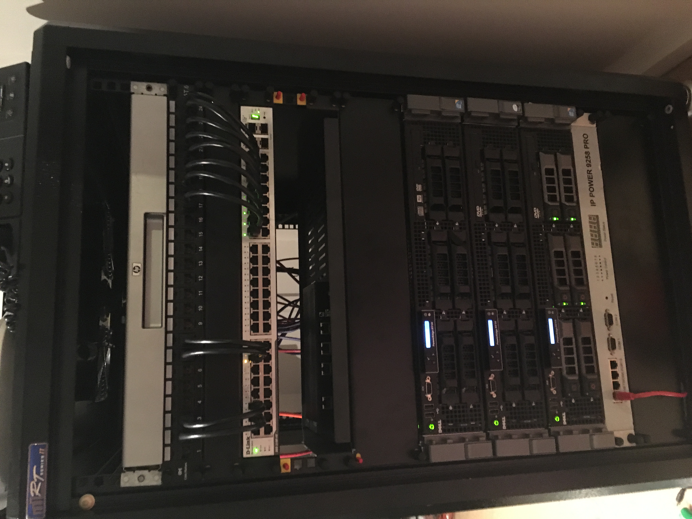
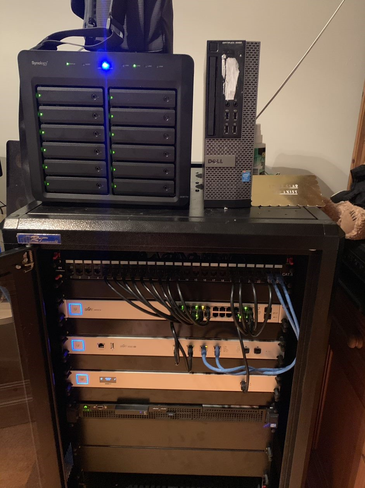

I had a lot of time over Christmas, and I decided to rebuild my homelab. The intent behind this series of posts is to describe my process, whilst demonstrating the value of a homelab to a Cyber Security Professional, especially if you are trying to interact with operations or architects. 

Before we get to that point though, I feel a brief history lesson of how I've gone through homelabs over the years, how it's evolved, and what I've learnt through the years. Whilst I'm not going to go through every iteration (there was a lot of changes over the years), I am going to talk about what the most "iconic" setups were.

## prehistory:
Way back when, @wan0net was a small, 17 year old, waiting to start his university degree. He wanted to try out Linux. So he took his trusty Acer TravelMate laptop that was bought for him for passing his GCSE's two years ago and  says, what the hell, why not install Linux on here?

And so his rabbit hole down the path of Linux began, and the first time he went "Oh crap I just killed my Windows install."

First I made the mistake of trying Gentoo. This was the time when bandwidth caps existed (Our house had a monthly cap of 12Gb(!), except Bigpond had a trick where the last day of the month they uncapped you. Thats when we did all our downloading), and the Gentoo ISO looked significantly smaller than anything else I could find. Oh how I was wrong, and lets just not talk about that one. And because I didn't have a reinstall disk for Windows at the time... I was stuck with Linux.

Then I tried OpenSUSE because I went to a gaming cafe one day and they just happened to have a spare CD. That lasted for a while. At this point, the hinges on my laptop had actually broken, so I had the laptop on a cabinet by the side of my bed, a keyboard and mouse in my lap in bed, and a monitor on a side table. I wish I had a photo because it is just the epitome of a teenage boy who broke his toys and then needed to find a way to make it work.

Finally, I met Ubuntu, which started a longstanding relationship with the distro. In those days (and I think still now?) you could order an Ubuntu CD to be delivered to your house, with stickers, free of charge. No bandwidth issues anymore! Based on what is terrible memory I'm going to say that I started with Hardy (8.04 LTS), and ever since then I've used every single LTS edition of Ubuntu without fail, and ignored the other editions.

An accurate representation of this entire story can be seen below:

This all happened pre- me having a dedicated "lab" compared to my normal "prod", but it's good context for where I went next.

## homelab v1: eeePC + external drives (2010)

### Specs

- Asus eeePC 904HA
  - Intel Atom B270 @ 1.6GHz
  - 1Gb DDR2
  - 160Gb HDD
  - Wifi 802.11 b/g
  - 1Gb Ethernet
- 2 x Seagate 2TB External Drives

### History
This was the first in a line of reusing equipment that I no longer used day-to-day. I was in my second year of university, and had just bought a new Acer Netbook (I think it had Windows 7 on it). So my old Asus eeePC was turned into an Ubuntu Server NAS, with two external Seagate drives that were purchased from Harvey Norman for $99 (a deal at the time). This is where I started playing about with things like [XBMC, now Kodi](https://kodi.tv) and [znc](https://wiki.znc.in/ZNC), running them on the server and accessing them from my netbook. 

## homelab v2: the microserver and the whitebox (2013)

### Specs

- HP N54L Microserver
  - 8GB DDR2 RAM
  - 6 x WD Red 3TB Drives

- Whitebox ESX Host
  - AMD FX-6300 
  - 16Gb DDR3
  - 2 x 2TB Seagate Shucked Drives
    
### History

This is when I started to move into dedicated machines. I don't think I can find a photo of the Microserver, which is an utter embuggerance to be honest, but we are talking the OG HP N40L Microserver as seen above

This thing was an utter dream. Did you know you could fit 6 3.5" drives in this? Through searching of random forums (probably [Whirlpool](https://whirlpool.net.au/)), I found a bracket that PC Case Gear sold that would go in the 5 1/2" bay of the Microserver and allow two drives to be mounted instead of one, due to clearance. Where did the extra SATA come from you ask? The back of the Microserver, which had an eSATA port! 

On this box I ran Ubuntu for a bit, then I heard of ZFS and FreeNAS, and I wanted some of that. Would have. been RAIDZ1 on this box. This ran as the media host for our family, and our TV’s used… Wii’s to connect over SMB to it to watch TV. Yep, a Homebrew Wii was our equivalent of a Chromecast back then. 

## homelab v3: custom built nodes (2016)

## homelab v4: the allbids special (2018)

## homelab v5: the initial hit of ubiquiti (2019)

## homelab v6: full on ubiquiti madness (2020)

The first year of the COVID pandemic I moved into a much larger 4 bedroom house. That meant I needed, or at least I thought I needed, a more substantial networking setup. I ran conduit through the house against the baseboards with the ultra thin Monoprice CAT6 RJ45 cabling, and created a 10Gbe backbone from my garage rack, to the front room. There were 3 access points, 2 Unifi nanoHD’s and a flexHD (exact same electronics just a different form factor), all connected using a Unifi Aggregation Switch to a Unifi Dream Machine. It was… overkill to say the least.

## homelab v7: the dark ages (2021)
I didn't do a lot with the homelab after 2020 to be honest. I ripped out most of the ubiquiti gear as I'd had too many issues keeping it running (when the UDM-PRO had an update the RJ45 SFP+ would stop working for example), and it didn’t really work as well as I wanted in mesh mode (Zero kept eating the Monoprice cables when he could access them). I replaced my entire Ubiquiti setup with a set of two Asus XT8 that was, and continues to be, utterly amazing. I bought a new DX1215 for the Synology NAS so that I could upgrade the storage to XXX Tb. And all I really did was run docker containers - nothing fancy, just a few apps here and there.

Life got far too busy for me to do things. I had two dogs who arrived to live with me, I became incredibly sick, and work was very busy. I just didn't *feel* like fiddling and tinkering. It's the same feeling I had when I swapped from Android to iPhone way back in 2016 - I just wanted something that worked.

## homelab v8: the golden age (2023)