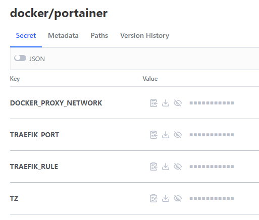

This is being written as the first post for the homelab series. In this, I describe the creation of my docker-compose files, and the management of secrets within this.

Lets take [Portainer](https://www.portainer.io/) as an example. You can get this going with a fairly simple ```docker-compose.yml``` file.

```docker
version: "3.7"
services:
  portainer:
    image: portainer/portainer-ce:latest
    hostname: "portainer"
    container_name: "portainer"
    environment:
      - "TZ=Australia/Sydney"
    ports:
      - 9443:9443
      volumes:
        - ./config:/data
        - /var/run/docker.sock:/var/run/docker.sock
    restart: unless-stopped
```
In simple terms, this file pulls the ```portainer/portainer-ce:latest``` image, opens up port 9443, and mounts a folder and the docker unix socket (needed for Portainer to be able to manage the docker host it's placed on). 

## reverse proxy
I don't really want all of my docker containers directly accessible from my network, especially when a number of them don't have TLS, and they would end up taking so many individual ports that I'd have to remember each one. So, I use a reverse proxy. I chose to use Traefik for a number of reasons, and this isn't intended to be a tutorial on how to manage Traefik (that may come later.). The following is the ```docker-compose.yml``` after I've enabled this.

```docker
version: "3.7"
services:
  portainer:
    image: portainer/portainer-ce:latest
    hostname: "portainer"
    container_name: "portainer"
    environment:
      - "TZ=Australia/Sydney"
    volumes:
      - ./config:/data
      - /var/run/docker.sock:/var/run/docker.sock
    restart: unless-stopped
    networks:
      proxy:
    labels:
      - "traefik.enable=true"
      - "traefik.http.routers.portainer.tls=true"
      - "traefik.http.routers.portainer.entrypoints=websecure"
      - "traefik.http.routers.portainer.rule=Host(`portainer.example.com`)"
      - "traefik.http.services.portainer.loadbalancer.server.port=9443"
      - "traefik.http.services.portainer.loadbalancer.server.scheme=https"
networks:
  proxy:
    external: true
    name: proxy_net
```

The changes to this file now say that portainer will run on the ```proxy``` network (which Traefik also should be connected to), and sets a few variables that configure Traefik including:
- Telling it to proxy the docker container on the ```websecure``` endpoint - which is HTTPS in my case.
- Enable access through ```portainer.example.com```
- That the port that Portainer is listening to is port 9443.
- The protocol that 9443 is listening for is HTTPS
  
## managing secrets

The problem with this approach is that I have embedded my secrets in the docker-compose files, and that means I have to secure my git repository. That's not a great option when I want to share the code with other people. I also don't want to make it difficult for other people to replicate what I did.

Secrets can instead be included by docker through environmental variables or through docker secrets. I'm not entirely comfortable with docker-secrets, and it doesn't (imo) provide as much flexibility, so I'm using environmental variables. You can see I already do that with a docker-compose defined ```TZ``` variable, which sets my timezone. But we can also pull from the environment which runs ```docker-compose```. To do that, we modify the ```docker-compose.yml``` file to include variables of the things we don't want to be stored in git:

```docker
version: "3.7"
services:
  portainer:
    image: portainer/portainer-ce:latest
    hostname: "portainer"
    container_name: "portainer"
    volumes:
      - ./config:/data
      - /var/run/docker.sock:/var/run/docker.sock
    restart: unless-stopped
    networks:
      proxy:
    labels:
      - "traefik.enable=true"
      - "traefik.http.routers.portainer.tls=true"
      - "traefik.http.routers.portainer.entrypoints=websecure"
      - "traefik.http.routers.portainer.rule=${TRAEFIK_RULE}"
      - "traefik.http.services.portainer.loadbalancer.server.port=${TRAEFIK_PORT}"
      - "traefik.http.services.portainer.loadbalancer.server.scheme=https"
networks:
  proxy:
    external: true
    name: ${DOCKER_PROXY_NETWORK}
```
But how do we pass the variables to the ```docker-compose``` command?

### 1. manually add to environment variables
**Good** : Easy to do

**Bad** : You have to remember them. They're also set for the rest of that application session.

Run the following commands in a terminal.
```bash
export TZ=Australia/Sydney
export DOCKER_PROXY_NETWORK=proxy_net
export TRAEFIK_RULE=Host(`portainer.example.com`)
export TRAEFIK_PORT=9443
docker-compose up -d

```
### 2. create a .env file in the folder and include the variables


**Good** : Stores your variables for you.

**Bad** : You shouldn't check them into your git repository else others can see them. You then have to create them when you clone git, which leads to the "Bad" of #1.

```bash
echo TZ=Australia/Sydney > .env
echo DOCKER_PROXY_NETWORK=proxy_net > .env
echo TRAEFIK_RULE=Host(`portainer.example.com`) > .env
echo TRAEFIK_PORT=9443 > .env
docker-compose up -d
```

### 3. use a secrets management application in order to store the secrets.

**Good** : No variables stored in files and git., and variables go *poof* when the session ends.

**Bad** : More complex.

Now I'd already decided to use [Hashicorp Vault](https://www.vaultproject.io/) in the homelab in order to manage secrets, so I had a poke around and discovered [envconsul](https://github.com/hashicorp/envconsul). This, despite it's name, does not require a Consul setup, connects to your Vault instance and downloads secrets to set them into environment variables. And it's really easy to use.

```bash
export VAULT_ADDR= # This should already be set but in case it's not, do that
export VAULT_TOKEN= # Set this with whatever token you want
envconsul -pristine -secret="/kv/secret" -no-prefix=true -vault-renew-token=false env
```

When you run the above command, consul will pull the secrets held at ```/kv/secret``` and put then into environment variables. Then ```env``` will print the environment variables.

Now the additional flags are somewhat my preference but:
- ```-no-prefix=true```: Means that it won't prefix your environmental variables with the path to the secret, in this case ```kv_secret_```
- ```-pristine```: Stops any mangling of secrets
- ```-vault-renew-token=false```: Is an error that comes up with root token. You should definitely not use the root token in production.

So the first step is to create our secrets in vault. You can do that from the CLI, I did it from the GUI just because.



Once the secrets are in there, you can run envconsule. I create a deploy.sh file in each project folder, and for portainer it is.

```
envconsul -pristine -secret="/kv/docker/portainer" -no-prefix=true -vault-renew-token=false docker-compose up -d
```

As the previous example, it pulls the secrets from the location, then runs ```docker-compose up -d``` with the variables, which are passed through to the docker container. Magic!


## chicken and the egg
So, isn't there a chicken and the egg problem when we rebuild?
- Vault isn't up because there's no Traefik.
- Traefik isn't up because there's no secrets.

Well, there's an easy way to solve that.

You remember that `VAULT_ADDR` variable we created?

You can just run the Vault docker image locally, with your data, and set that as the addr. You did create a backup of your data didn't you?