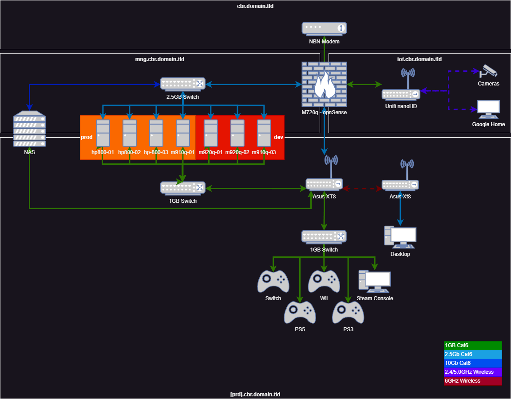

So you've read my post on the history of homelabs, or you've managed to find your way here from somewhere else, and you're wondering how to decide how to pick the physical layout of your network, some tips and tricks on hardware, and a brief runthrough of how I decided to build my network.

## picking the apples
Choosing your hardware is something that will be a personal decision:
- Do you have space for large devices, heat, and cooling as well as the electricity bill?
- What type of compute are you trying to do - mostly CPU, or do you want GPU as well?
- What kinds of storage are you going to want to use?
- How do you want to manage the server?
- Is there a partner factor to take into account?

Below I'll talk about some of the options for this.

### age (i.e. noise and power)

### capacity

### management

### partner factor 

### my decision
For me, I was inspired by the [ServeTheHome TinyMiniMicro series ](https://www.servethehome.com/perfect-project-tinyminimicro-pushing-a-1l-pc-as-a-server-concept-intel-hp-sabrent-crucial/), which talks about the use of 1L sized desktop units which are traditionally used by companies for their employees.

## lay it all out

_I highly recommend something like ())[draw.io] for network diagrams, until we can come up with an app that automatically makes them for us based on some kind of script_

### cbr.domain.tld

### [prd].cbr.domain.tld

### mng.cbr.domain.tld

### iot.cbr.domain.tld
