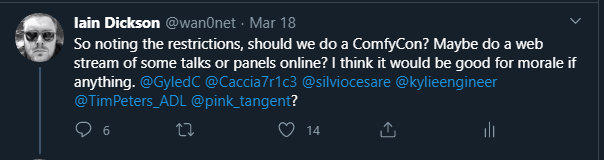
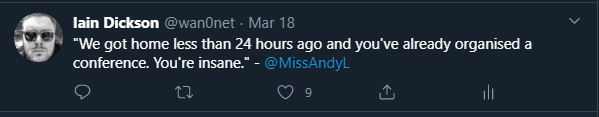
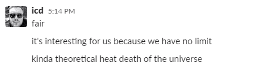
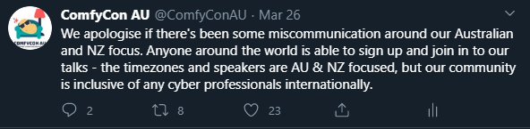

It’s less than 24 hours after we finished, but all of these thoughts are running through my mind. I wanted to capture them before we lost them.

## ComfyCon AU?

In the beginning, there was a tired, redheaded “cyber guy”. He’d just gotten off over 24 hours of flights with his partner, cutting their holiday short and returning with their tail between their legs to their home country before all intermediate countries closed their borders.

He was supposed to go to Brisbane 2 days later to present at a conference, but that had already been cancelled. There were murmurs that other cons would have to cancel, and we’d all have to go into isolation.

So this tweet happened:

*I’ve since been told I’m not allowed to post bright ideas on Twitter anymore.*

And that started it all.

Less than 12 hours later, ComfyCon AU had a logo, an organisational team with mentors, a RedBubble store for merch, a website, and an EOI for speakers. Also this:

*It later turned out I was INCREDIBLY jetlagged.*

3 weeks later, over Easter, we held the conference. And by all accounts, it has gone down really well with the community. We had 1200 people sign up (though we didn’t require sign ups, more on that later), from numerous countries (Australia, New Zealand, Germany, UAE, Indonesia), 103 sales of merch (with multiple items per sale, and more still coming in), and over 16 hours of footage to cut into chunks.

And a community brought together in really difficult circumstances.

This post is less so about the technical details, and we’ll come to those in another post. But how did we build a virtual conference, what do we think worked well, and what would/will we do next time?

## make it easy to run

### money

One of the rules we made early on was simple. We didn’t want to touch money.

We didn’t want to have people give us money, and have to store it. We didn’t want sponsors to give us money for specific return on investment. We didn’t want people to give us money for merchandise, which we would have to store if we didn’t sell it.

There was only one sponsor for ComfyCon AU, and they provided a thing. Something we needed rather than money. Not that we didn’t spend money, our total outlays for the entire con were about AUD $300. I’d highly recommend the model moving forward, IF it is achievable. If you have money to run a con, or you’re a business though, go forth! But choose things that benefit the community.

### technology stack

We had decided to run a conference in 3 weeks on a shoestring budget, with all of us holding full time jobs. We wanted a technology stack that would _just work._ Something that we could rely on to not break, and also be safe for our speakers.

I think we made the decision on the 18th or 19th that we were going to use Zoom, and we were going to output the feed from Zoom to YouTube and Twitch. Zoom had seemed to have held up more than Webex (this is my personal opinion) over the past week or so before that when all businesses had started moving to working-from-home arrangements. There had been some security issues identified with Zoom, but (as risk based cyber professionals), we believed they posed low risk to our speakers and attendees. We also had no issues at all with capacity management going down this path, I mean, what is the likelihood of YouTube going down?

*Accurate limit to the conference*

Over the next couple of weeks more and more vulnerabilities came out, and there were more and more suggestions we should move from Zoom to another provider, or self host our own service. I think we made the right decision, and we stuck with it. Would we use Zoom moving forward? Probably not, and we’re looking at other options. But did it enable all of our objectives? Hell yes.

It’s almost a bit like cyber in that respect — think about your tools, and what you need to get out of them. Don’t always go for the shiny new thing, tried and tested _is_ tried and tested for a reason. If you’re short on time, look for those existing patterns, and use them. We did this all over the con. And in our case, what’s free? Zoom itself was being provided by our one sponsor, and any other option would have cost us more money, and time to learn how to use.

Slack is another example. Honestly, if I had thought about it for another half an hour, we probably would have gone with Discord instead, and there were some questions whether we could do it for the con. But by sticking with the same Slack channels throughout the entire process, we made it easier for people to interact and join in. More on that later. 

## make it easy to participate

### one point of confluence

Choosing Slack as the single point of confluence for everyone to come in and talk with everyone else was driven by the want to have those traditional conference experiences.    

I generally walk into a conference, and find someone I haven’t seen for years sitting or standing there. We’ll catch up, see how each other is doing, and organise to see each other again. We wanted to emulate that in this conference.

We turned off YouTube comments and Chat on the Live Stream for this reason. We understand it might have been a pain for some people to ALSO have a Slack account and login. But it was this that drove a lot of the community interaction, the meeting of new people and sharing of ideas, and I think we still had that feeling of finding someone you recognised.

The other reason for doing this was for moderation purposes. We wanted to make sure that we made the community as inclusive as possible, and enabled people to participate in a safe environment. We had VERY few issues, much less than we believed would happen. But to enable that, we wanted to make sure that we had moderators (shout out to them), and we made their job as easy as possible.

### no registrations required

Somewhat on the same theme as “We don’t want people’s money”, was “We don’t want people’s data”. Registration was designed to be entirely optional. We posted as much as we could on Slack, on YouTube and on LinkedIn to share the information. For those that wanted to, we also made it so you could give us your email address and could then be sent a copy of the links to the streams. But this was in no way mandatory. I think we could have done a bit better around the messaging of this one, as we did receive some messages from people after we closed “registration”, and I think some people didn’t try accessing the links. But thats lessons learnt for another time!

### no borders

Another issue in some of our messaging that we rectified was around our focus on Australian and New Zealand speakers. We were based in AEST, UTC+10, and we wanted to host the stream during that time period. We knew we wanted to make it easy for not only Western Australians, but also New Zealanders to participate, and that drove the 1200 AEST start time. But who could watch?

Anyone. We wanted to host a virtual conference that anyone could come to. There was no cost, all you needed was an internet connection. We wanted to show off Australian and New Zealand cyber talent to the world, and anyone could come and watch. And I think that worked.

### merch

Using RedBubble was a stroke of genius. We were able to create merch, and people were able to order it online, to their houses, and there was no need for us to be involved. It allowed another way to enable people to participate in the conference, and take something away with them.

One thing we were wary of, and will continue to be wary of is the stealing of our logo and the selling of merch under other stores. We made a very concious decision to not add a profit margin to our merch — it literally cost what it cost. But other stores were not as scrupulous. I filed my first DMCA, for the purpose that it was actually intended, but it’s a continuous job.

## engage the community

### mentorship

We lucked out pretty early on that a couple of in-person cyber conference organisers messaged us and wanted to support us. They helped provide us direction, offered to set us up with speakers, and gave us advice on how to move forward. Their help was invaluable, and I do not envy the job they have in running their existing conferences. Which brings me onto our next point.

### integration, not subjugation or replacement

I don’t think I can emphasise the below sentence big enough.

_We did not want to, and would not, replace traditional in-person cyber conferences_

Our aim was simple. In Person conferences were out, and the organisers of those already had a mountain of work to do to clean up the fallout. Everyone was having, quite frankly, a shit time, being stuck in self isolation, not being able to engage with conferences, listen to speakers, or learn new things.

We created ComfyCon AU not as a replacement, but an integrated part of the cyber community and the cyber conferences within Australia and New Zealand. And to be honest, if we went away after the in-person conferences could be held again, we were totally fine with that.

Someone asked if we had an easier job because speakers had talks they were giving to other cyber conferences that were cancelled, and they gave them at ComfyCon AU. It turns out that 90% of speakers were talking about something new. Others were talking about things they had talked about before. We wanted to provide a platform for people to talk about things that other (and I’m using air quotes here) “traditional” cyber conferences didn’t deal with.

### cyber adjacent topics

I think I told this story on the stream, but a great example of this is our talk on meditation. The speaker messaged us really early on and told us that he had a great idea for a talk on meditation, and felt like it was a really important message to provide to all of the community, not just for the current crisis, but for the continued stressful work that we do, day in, day out. And we said “Hell yes”.

I think one of the great things we did was to include topics that were cyber adjacent. Highly relevant for our careers, and our lives, but not necessarily about cyber security. Our talk on CIA including psychology and experience is another example, the talk on kickass women too.

## inclusion

About halfway through day 2 I received a message.

The ComfyCon AU team are not people who traditionally run events, and this was something we completely forgot to do. Rather than forget about it, we wanted to own up, and do something. We were also unsure of how to approach this topic, noting we were a virtual conference, but we engaged with the person who raised this, and this is what we came up with:
_We would like to acknowledge the traditional custodians and owners of the many lands we are meeting on today, in Australia and around the world, and pay our respects to their elders past and present._

_We also extend that respect to any Aboriginal and Torres Strait Islander People joining us for ComfyCon._

I’m still not sure if this is an appropriate wording, so if it isn’t, I apologise, and we would love to have some more advice. I’d also like to integrate a welcome to indigenous peoples from New Zealand (Toni or Caitlin if you’re reading this, I’d love your advice on this one)

We wanted to make this event inclusive, and this was us trying to make that happen. Pronouns is another example. We didn’t explicitly ask this on our EOI form, but we wanted to make sure we used the right ones for our speakers, and we will be including this moving forward. It’s these little things that we realised made everyone feel welcome and included.

## mentally and physically safe

A number of topics discussed could potentially trigger traumatic memories or induce unwanted or unsafe feelings in our speakers and viewers. A great example of seeing trigger warnings and safe spaces was our OSINT talk presenter, who included dedicated slides indicating where the triggers were, and when the material had ended. @goatindex has also provided the following link, for more information

[An Introduction to Content Warnings and Trigger Warnings](https://sites.lsa.umich.edu/inclusive-teaching/2017/12/12/an-introduction-to-content-warnings-and-trigger-warnings/)

We plan on asking all speakers next time to identify triggers in their content, so we can put appropriate safe guards in place.

## fin.

ComfyCon AU is one of the proudest moments I’ve had in a long time. I don’t think it’s unfair to say that we brought together a large chunk of the community in a really difficult time, and enabled everyone to interact, speak, have fun, joke, troll Silvio (sorry Silvio), and try and forget for a while the really shitty situation we’re in. This is my experience in running it, and I hope that this can enable someone else to do something similar. But in summary.

Would I run a physical conference? Hell no.

Would I run a virtual conference again? Yes. In a heartbeat.