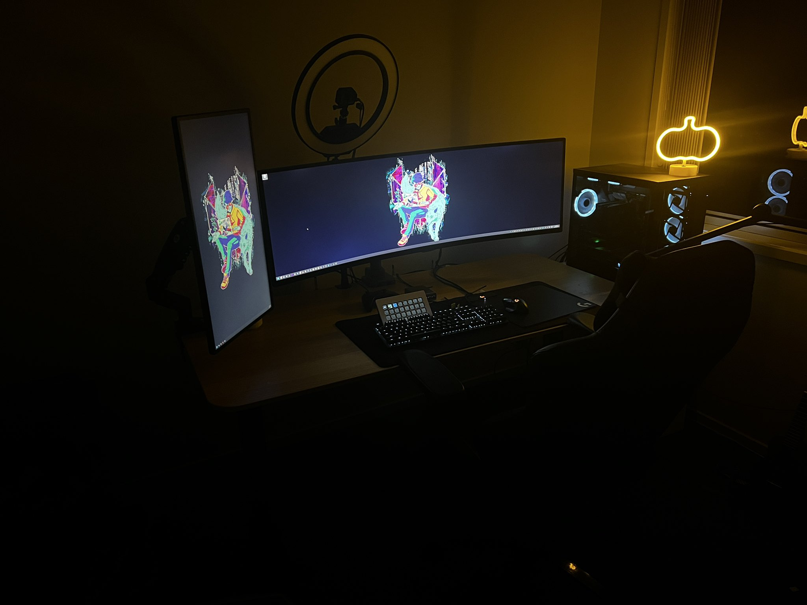

## my use case
So I primarily have three use cases for computing at home. Gaming, Projects, and just general life.
### gaming
### projects
### life

## this site
- Hugo
- Congo theme for Hugo
- GitHub Pages

## apps

### web
- Proton Mail

### mobile

### thick
- chocolatey
- Google Chrome
- Notion
- Visual Studio Code

## desktop

### specs
- AMD Ryzen 7 5700x CPU
- Asrock X570 Steel Legend WiFi ax Motherboard
- Corsair Vengeance LP 64GB RAM
- Asus TUF nVidia RTX 4070 12GB GPU
- Samsung 970 Evo Pro 512GB SSD
- Crucial P3 2TB SSD
- Corsair CX750 750w PSU
- USB Controller Cards
- Lian Li O11 Dynamic Evo Case

### desk
- IKEA Bekant Sit-Stand Desk
- LG 49" Ultrawide LC49RG90SSEXXY Monitor
- Viewsonic 27" QHD VA2719-2K-SMHD Monitor
- Elgato Ring Light
- GoPro 7 (with Elgato Cam Link 4K)
- Elgato Wave 3 Mic
- Fosi Audio K5 Pro DAC
- Sennheiser 599 Headphones
- Creative Gigaworks T20 ii Speakers
- Logitech Powerplay Mousepad
- Logitech G502 Lightspeed Mouse
- Logitech G512 (Blue) Keyboard
- XBOX One Series Controller

## consoles
- Playstation 5
- Steam Deck
- - dBrand Skin
- 
## ipad
- iPad Pro 12.9-inch 5th Generation

## iphone
- iPhone 

## 3d printers